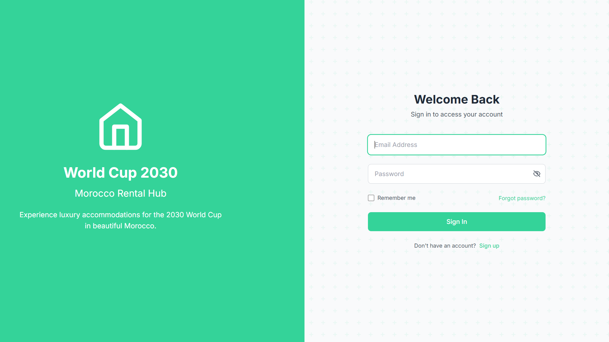
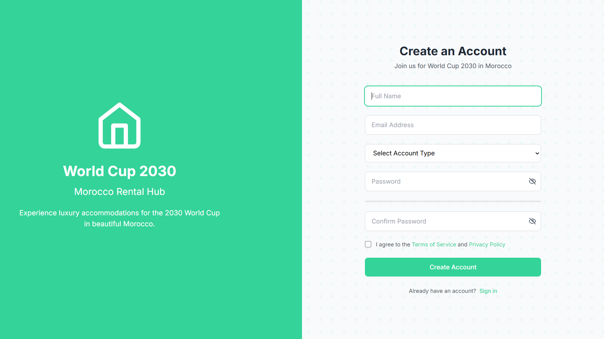
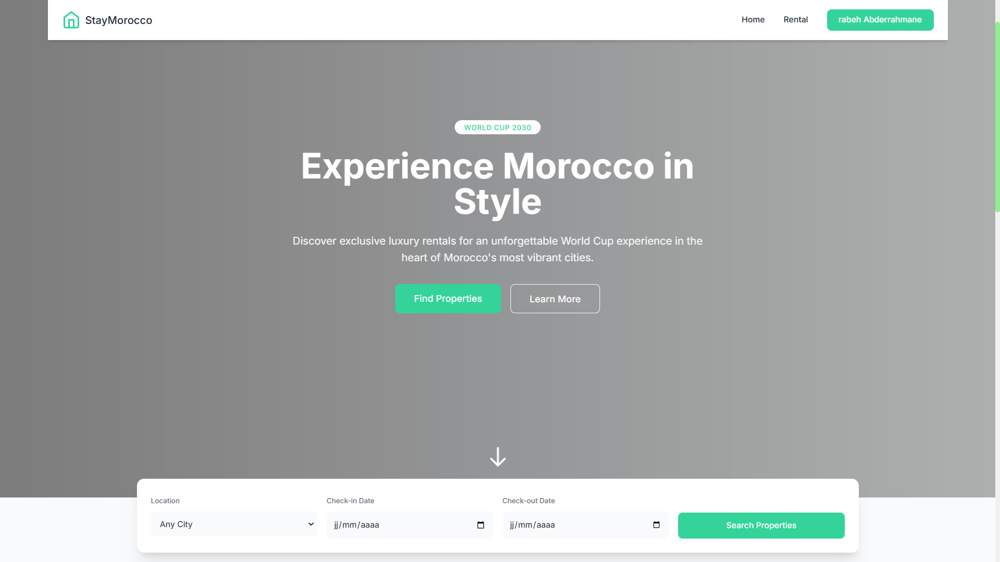
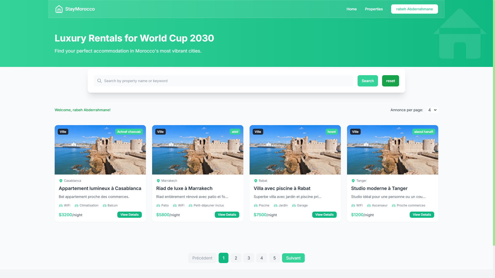

# TouriStay 2030 - Plateforme d'hébergement pour le Mondial 2030

## 🌍 Description du projet

TouriStay 2030 est une plateforme innovante dédiée à la location d'hébergements pour les visiteurs du Mondial 2030 co-organisé par le Maroc, l'Espagne et le Portugal. Notre solution permet aux propriétaires de publier leurs biens et aux touristes de trouver facilement un logement adapté à leurs besoins pendant cet événement sportif international.

## 🎯 Objectif

Faciliter la mise en relation entre propriétaires et touristes dans le cadre du Mondial 2030, en proposant une plateforme sécurisée, intuitive et complète pour la gestion des locations temporaires.

## 📷 Aperçu du Projet

Voici un aperçu visuel de notre plateforme TouriStay 2030 :






## 🚀 Fonctionnalités principales

### 🔐 Authentification et Gestion des Profils
- Inscription et connexion sécurisées pour tous les utilisateurs
- Interface personnalisée selon le type d'utilisateur (propriétaire, touriste, administrateur)
- Modification des informations personnelles et gestion de profil

### 🏡 Gestion des Annonces
- Publication d'annonces détaillées par les propriétaires
- Indication de la localisation, du prix, des équipements et des disponibilités
- Modification et suppression des annonces par leurs propriétaires

### 🔍 Recherche et Navigation
- Recherche avancée par ville et dates de disponibilité
- Exploration des offres d'hébergement avec pagination dynamique (4, 10, 25 annonces par page)
- Système de favoris pour sauvegarder les annonces intéressantes

### 👨‍💼 Gestion Administrative
- Modération des annonces (suppression du contenu inapproprié)
- Tableau de bord avec statistiques (inscriptions, locations, annonces actives)
- Surveillance de l'activité de la plateforme

## 💻 Technologies utilisées

- **Backend**: Laravel
- **Frontend**: HTML, CSS, JavaScript
- **Base de données**: MySQL
- **Authentification**: Laravel Breeze/Sanctum

## 🛠️ Installation

```bash
# Cloner le dépôt
git clone https://github.com/votre-username/TouriStay-2030.git

# Accéder au répertoire du projet
cd TouriStay-2030

# Installer les dépendances
composer install
npm install

# Configurer l'environnement
cp .env.example .env
php artisan key:generate

# Exécuter les migrations
php artisan migrate

# Démarrer le serveur
php artisan serve
